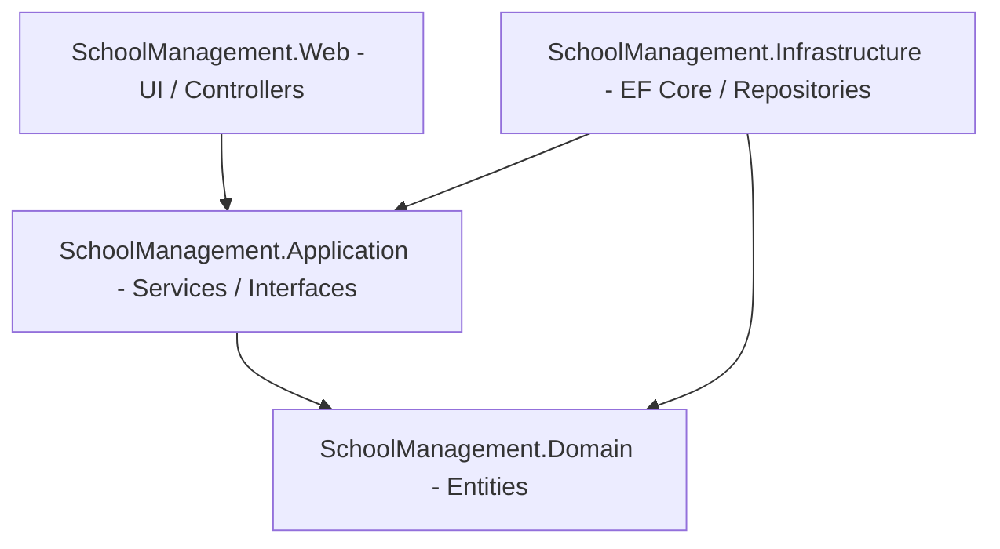

# School Management System (SMS) - System Architecture & Implementation

This document provides a comprehensive overview of the technical architecture and code implementation of the School Management System (SMS). It explains the structure of the application, how the data flows, and how the core features—including authentication, database operations via stored procedures, and the binary photo upload system with auto-compression—are implemented.

---

## 1. Technical Architecture (Clean Architecture)

The system is designed following the **Clean Architecture** guidelines, ensuring strict separation of concerns, high testability, and decoupling of domain logic from database and presentation frameworks.



### Core Projects & Layers

1. **`SchoolManagement.Domain`**
   * **Purpose**: Core enterprise models and validation entities. It does not depend on any other project or external framework.
   * **Key Components**:
     * C# representation of database tables (e.g., [StudentInfo.cs](file:///C:/Users/Steve/.gemini/antigravity/scratch/sms-mvc/src/SchoolManagement.Domain/Entities/StudentInfo.cs), `ClassMaster`, `DivisionMaster`, `FinancialYear`, `ClassSchedules`, `StudentMappings`).
     * View models mapping complex queries (e.g., [StudentDetailsView.cs](file:///C:/Users/Steve/.gemini/antigravity/scratch/sms-mvc/src/SchoolManagement.Domain/Entities/StudentDetailsView.cs) matching database view `vw_StudentDetails`).
     * Common generic return models (e.g., `DbOperationResult` and `DashboardData`).

2. **`SchoolManagement.Application`**
   * **Purpose**: Business rules orchestration, service layer declarations, and core application workflows.
   * **Key Components**:
     * Repository and service interfaces (e.g., `IStudentRepository`, `IStudentService`, `IAuthService`).
     * Password hashing algorithms (using PBKDF2 SHA-256 Identity V3) for secure authentication.

3. **`SchoolManagement.Infrastructure`**
   * **Purpose**: External integrations, database management, and EF Core mappings.
   * **Key Components**:
     * `SchoolDbContext`: Inherits from EF Core's `DbContext`. Maps stored procedures and views. Fluent API mappings handle properties like ignoring the unused `RecordId` on `DbOperationResult`.
     * Repositories (e.g., [StudentRepository.cs](file:///C:/Users/Steve/.gemini/antigravity/scratch/sms-mvc/src/SchoolManagement.Infrastructure/Repositories/StudentRepository.cs)): Leverages EF Core's `FromSqlRaw` to run database-stored procedures.

4. **`SchoolManagement.Web`**
   * **Purpose**: Presentation layer using ASP.NET Core MVC (Targeting .NET 7.0).
   * **Key Components**:
     * MVC Controllers (e.g., [StudentsController.cs](file:///C:/Users/Steve/.gemini/antigravity/scratch/sms-mvc/src/SchoolManagement.Web/Controllers/StudentsController.cs)): Handles web requests, mapping actions, and validating model binds.
     * Razor Views (`.cshtml` files): Generates dynamic HTML.
     * Configuration files (`appsettings.json`): Manages local connection string settings.
     * Startup setup (`Program.cs`): Hooks up cookie middleware and Dependency Injection containers.

---

## 2. Authentication & Authorization

The system implements cookie authentication and role-based access control.

* **Session Middleware**: Configured in `Program.cs` using `.AddCookie` default authentication schemes.
* **Roles**:
  * `Administrator`: Full system authorization. Can manage Financial Years, Divisions, Classes, Class Schedules, and Students.
  * `Clerk`: Data-entry restricted access. Authorized to edit/add students and manage class allocations. Restricted from accessing system configuration screens.
* **Security Mechanics**:
  * Passwords are encrypted using PBKDF2 with SHA-256 (10,000 iterations + Salt).
  * Controllers are decorated with `[Authorize]` or `[Authorize(Roles = "Administrator")]` attributes. Unauthorized users are dynamically redirected to `/Account/AccessDenied`.

---

## 3. Database Operations (SP-First & Views)

To leverage SQL Server's performance and transaction capabilities:
* **Mutations (Insert/Update/Delete)**: Routed through stored procedures (e.g., `usp_Student_Save`, `usp_Student_Delete`, `usp_FinancialYear_Save`). The procedures run inside transactions and write audit logs into `AuditLogs` automatically using SQL Server's native `FOR JSON PATH` mechanism.
* **Queries**: Structured as database views (e.g., `vw_StudentDetails`, `vw_ActiveClassSchedules`). Stored procedures select from these views (e.g., `usp_Student_GetAll`, `usp_Student_GetById`, `usp_Student_Search`) to retrieve full, denormalized records.

---

## 4. Student Photo Binary Management & Auto-Compression

Previously, student photos were saved as paths pointing to local disk folders. This was converted to a **strictly database-bound binary format (`VARBINARY(MAX)`)** stored in the database.

### The Problem
Allowing raw 5 MB+ image uploads directly into a database causes rapid database storage expansion, slows down reads/writes, and impacts memory utilization during Base64 rendering.

### The Solution: General Image Compressor
We created a general compression handler in `StudentsController` using `System.Drawing.Common`. Any uploaded image is compressed to under 500 KB (typically **< 150 KB**) while preserving high visual clarity.

#### Compression Pipeline:
1. The client uploads an image file via the `IFormFile studentPhoto` parameter in the `Create`/`Edit` post-actions.
2. The image is passed to `CompressImage(IFormFile file)`.
3. It initializes a memory stream of the raw file and reads it as a `System.Drawing.Image`.
4. It checks the dimensions. If the width or height exceeds `1000px`, it calculates the aspect ratio and scales the image down to fit within a `1000x1000px` bounding box.
5. It instantiates a new high-quality `Bitmap` drawing context, applying high-quality bicubic interpolation and compositing quality properties.
6. It encodes the resized bitmap as a **JPEG image with 75% quality**, which hits the sweet spot of visual quality vs. size reduction.
7. The output byte array is stored in the student model's `StudentPhoto` (`byte[]`) field and passed to `usp_Student_Save` as a `SqlParameter`.

```csharp
private byte[] CompressImage(IFormFile file)
{
    using (var memoryStream = new MemoryStream())
    {
        file.CopyTo(memoryStream);
        memoryStream.Position = 0;
        
        using (var originalImage = Image.FromStream(memoryStream))
        {
            // Calculate new dimensions (max width/height of 1000px to maintain clarity and small file size)
            int maxWidth = 1000;
            int maxHeight = 1000;
            int newWidth = originalImage.Width;
            int newHeight = originalImage.Height;
            
            if (newWidth > maxWidth || newHeight > maxHeight)
            {
                double ratioX = (double)maxWidth / originalImage.Width;
                double ratioY = (double)maxHeight / originalImage.Height;
                double ratio = Math.Min(ratioX, ratioY);
                
                newWidth = (int)(originalImage.Width * ratio);
                newHeight = (int)(originalImage.Height * ratio);
            }
            
            using (var resizedImage = new Bitmap(newWidth, newHeight))
            {
                using (var graphics = Graphics.FromImage(resizedImage))
                {
                    graphics.CompositingQuality = CompositingQuality.HighQuality;
                    graphics.InterpolationMode = InterpolationMode.HighQualityBicubic;
                    graphics.SmoothingMode = SmoothingMode.HighQuality;
                    graphics.DrawImage(originalImage, 0, 0, newWidth, newHeight);
                }
                
                using (var outputStream = new MemoryStream())
                {
                    // Compress to JPEG with 75% quality for excellent clarity but small footprint
                    var jpegEncoder = GetEncoder(ImageFormat.Jpeg);
                    var encoderParameters = new EncoderParameters(1);
                    encoderParameters.Param[0] = new EncoderParameter(Encoder.Quality, 75L);
                    
                    if (jpegEncoder != null)
                    {
                        resizedImage.Save(outputStream, jpegEncoder, encoderParameters);
                    }
                    else
                    {
                        resizedImage.Save(outputStream, ImageFormat.Jpeg);
                    }
                    
                    return outputStream.ToArray();
                }
            }
        }
    }
}
```

### View Rendering via Base64 Data URIs
Since the image is stored as binary `byte[]` in the database, the views render it directly without hitting any physical file path.
Inside the Razor templates (e.g. `Index.cshtml`, `Details.cshtml`, `Edit.cshtml`), the binary photo array is checked for null. If present, it is dynamically converted to a Base64 string and embedded inside the HTML image source tag:

```html
@if (Model.StudentPhoto != null && Model.StudentPhoto.Length > 0)
{
    var base64 = Convert.ToBase64String(Model.StudentPhoto);
    var imgSrc = String.Format("data:image/jpeg;base64,{0}", base64);
    
}
else
{
    
}
```

---

## 5. UI Design Theme

The web app interface is styled with a custom **Crimson Red & Deep Velvet Burgundy** theme:
* **Typography**: Outfit Google Font via custom styling rules in `site.css`.
* **Layout**: Flexible grid/flex layouts with premium glassmorphism card panels.
* **Micro-Animations**: Clean, responsive hover scales on side nav links and action buttons to keep the application feeling responsive and premium.
